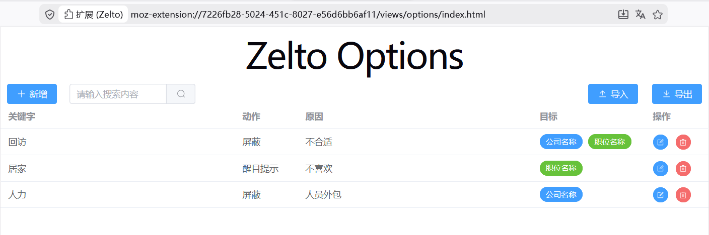

# Zelto

Zelto, 是一个浏览器插件, 用于对各大招聘网站的职位进行过滤, 目前支持的招聘网站有智联、鱼泡、Boss直聘等.

## 安装

* 使用Firefox浏览器, 在插件市场搜索zelto并订阅
* 或自己构建后在任意浏览器使用

## 使用指南

### 配置

在插件配置界面, 可以配置根据职位或公司名字中的关键词对职位进行过滤, 提高简历投递效率.



### 使用

配置完成后即可在招聘网站职位列表页面使用. 被设置为屏蔽的或醒目提示的职位会议灰色或黄色背景显示.


## 技术找

* 基础: Brower Extension、NodeJS、JavaScript、TypeScript
* 构建工具: Rollup、Rolldown、Gulp、Vite、Pnpm
* 前端框架: Vue、ElementPlus、SCSS

## 构建

### 前置要求

* 安装 nodejs 最新版

### 构建步骤

````shell
pnpm install
pnpm build
````
